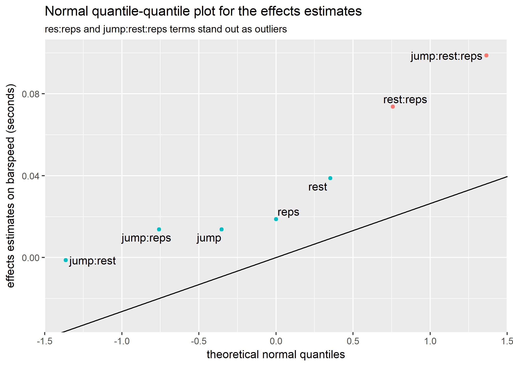

Experiment on the Warm-up routine for Squats: 2<sup>3</sup> Full Factorial Design
================
Christopher Oh
2017-11-28

-   [Motivation / Background](#motivation-background)
-   [Design](#design)
    -   [Structure](#structure)
    -   [Exercise Selection](#exercise-selection)
    -   [Response Variable](#response-variable)
    -   [Measurement](#measurement)
    -   [Factors](#factors)
-   [Experiment](#experiment)
    -   [Data preparation](#data-preparation)
    -   [Effects / standard error estimation](#effects-standard-error-estimation)
    -   [Normal qunatile-quantile plot](#normal-qunatile-quantile-plot)
        -   [Approach 1](#approach-1)
        -   [Approach 2](#approach-2)
        -   [Interpretation](#interpretation)
    -   [Two-way interactions](#two-way-interactions)
-   [Conclusion](#conclusion)

``` r
# Libraries
library(tidyverse)
library(broom)
library(knitr)
library(purrr)
library(ggrepel)
library(stringr)
library(rlang)
library(lazyeval)
library(glue)
```

-   Adapted from the report submitted to Stanford University's STATS 363: Design of Experiments.

Motivation / Background
-----------------------

Optimizing the warm-up routine (all the lifts that are done to get the lifter’s body prepared for the working sets) leading up to the “working sets” (the sets a lifter counts as a part of the workload done for the session) has been a goal of mine for some time.

While there exists a plethora of anecdotal evidence to various theories, there is not enough substantive scientific studies to support the claims.

Furthermore, individual differences have known to be one of the main considerations in designing a lifting program, with a wide range of variations regarding not only the fundamental structure of the programs (frequencies, intensities, volume, rep schemes, etc.) but also other aspects like warm-up routines and mobility drills.

Such settings provided me with an excellent opportunity to conduct an experiment on myself to test out different warm-up schemes and measure the efficacy on each on my “working set”.

Design
------

### Structure

Experiment was run in 2 blocks, with each block containing the full 2<sup>3</sup> data points.

Repetition was necessary to get an error estimate for the effects, since interactions between the effects were expected to be significant.

### Exercise Selection

High-bar squat with a weightlifting belt was used as the exercise for this experiment. The load for the “working set” weight (i.e., working weight) was chosen as 335lbs for a single repetition (i.e., rep), a weight that is not so taxing as to have a negative carryover effect from one session to the next and avoid having a positive carryover to the next session by strengthening the muscles involved in the movement.

### Response Variable

Bar speed of the working weight was chosen as the response variable that measures the efficacy of each warm-up routine in this experiment. How fast the bar travels in the concentric portion of the lift is an important indicator in two regards:

1.  It can be used as an indicator of a lifter’s one-rep maximum weight on a given exercise (Conceicao et al., 2016) [Movement velocity as a measure of exercise intensity in three lower limb exercises](http://www.tandfonline.com/doi/abs/10.1080/02640414.2015.1090010).
2.  It has been shown that repetitions at maximal intended velocity maximizes the training effect in terms of strength gains (Gonzalez-Badillo et al., 2014) [Maximal intended velocity training induces greater gains in bench press performance than deliberately slower half-velocity training](http://www.tandfonline.com/doi/abs/10.1080/17461391.2014.905987).

Therefore, an ideal warm-up scheme would maximize the speed of the exercise.

### Measurement

I measure the time between the bottom portion and the top portion of the lift as a measure of the how fast the bar moved (referred to as `bar_time` in the dataset).

A side-view video was recorded for each of the data points and by using a bar-tracking application (Kinovea), the travel time was measured.

An example of a measurement:


Note: The left snapshot shows the bottom of the lift, while on the right, the top of the lift is reached. Time is measured between the two.

### Factors

The three factors used for this experiment are:

1.  Weight jumps in the warm-up sets.
2.  Rest periods between the warm-up sets.
3.  Total number of repetitions for the warm-up sets.

These were determined based on personal lifting experience.

While higher jumps between the warm-up weights might be beneficial in conserving energy for the working weights, one runs the risk of not having the body fully-prepared to handle heavy loads.

Similarly, one might exhaust oneself too much with shorter rest periods or higher reps during the warm-up, but they might be needed to get the body warmed-up sufficiently.

The specific choices in the levels were also determined based on experience. For instance, the “high” level for the rest period was set at 150 seconds, while the “low” level was set at 90 seconds because I am aware that any period longer than 150 seconds or shorter than 90 seconds will never be attempted.

Details of the factor levels are shown below:

| Factors                   | High (+1)      | Low (-1)             |            |
|---------------------------|----------------|----------------------|------------|
| Jumps (lbs)\*             | 90-90-50-40-20 | 90-50-40-40-30-20-20 |            |
| RestPeriods (seconds)\*\* | 150            | 90                   |            |
| Repetitions\*\*\*         | 19             | 15                   | High Jumps |
|                           | 26             | 17                   | Low Jumps  |

Note:

\*Each warm up started out with a 45lbs bar.

\*\*A rest period of 150 seconds was taken before lifting the working weight.

\*\*\*Sliding levels were used for reps.

Experiment
----------

### Data preparation

Create the 2<sup>3</sup> factorial design grids for the 2 trials.

``` r
trial_1 <-
  tibble(jump = c(-1, 1), rest = c(-1, 1), reps = c(-1, 1)) %>% 
  expand(jump, rest, reps) %>% 
  arrange(reps, rest) %>% 
  mutate(trial = 1)
trial_2 <-
  trial_1 %>% 
  mutate(trial = 2)
```

Add recorded bar speed measurements.

``` r
bar_time_1 <-
  c(1.60, 1.60, 1.67, 1.53, 1.63, 1.53, 1.66, 1.77)
bar_time_2 <-
  c(1.57, 1.77, 1.63, 1.57, 1.60, 1.56, 1.60, 1.74)

trial_1 <-
  trial_1 %>% 
  mutate(bar_time = bar_time_1)
trial_2 <-
  trial_2 %>% 
  mutate(bar_time = bar_time_2)

# The experiment grid containing all 16 data points.
experiment_grid <-
  rbind(trial_1, trial_2)

experiment_grid %>%
  select(trial, everything()) %>% 
  knitr::kable()
```

|  trial|  jump|  rest|  reps|  bar\_time|
|------:|-----:|-----:|-----:|----------:|
|      1|    -1|    -1|    -1|       1.60|
|      1|     1|    -1|    -1|       1.60|
|      1|    -1|     1|    -1|       1.67|
|      1|     1|     1|    -1|       1.53|
|      1|    -1|    -1|     1|       1.63|
|      1|     1|    -1|     1|       1.53|
|      1|    -1|     1|     1|       1.66|
|      1|     1|     1|     1|       1.77|
|      2|    -1|    -1|    -1|       1.57|
|      2|     1|    -1|    -1|       1.77|
|      2|    -1|     1|    -1|       1.63|
|      2|     1|     1|    -1|       1.57|
|      2|    -1|    -1|     1|       1.60|
|      2|     1|    -1|     1|       1.56|
|      2|    -1|     1|     1|       1.60|
|      2|     1|     1|     1|       1.74|

### Effects / standard error estimation

Run linear regression to get estimates of the effects and the standard error of the estimates.

``` r
lm_experiment <-
  lm(bar_time ~ jump * rest * reps + trial, data = experiment_grid)

summary(lm_experiment)
```

    ## 
    ## Call:
    ## lm(formula = bar_time ~ jump * rest * reps + trial, data = experiment_grid)
    ## 
    ## Residuals:
    ##      Min       1Q   Median       3Q      Max 
    ## -0.08188 -0.01812  0.00000  0.01812  0.08188 
    ## 
    ## Coefficients:
    ##                 Estimate Std. Error t value Pr(>|t|)    
    ## (Intercept)     1.617500   0.041719  38.771 1.98e-09 ***
    ## jump            0.006875   0.013193   0.521  0.61836    
    ## rest            0.019375   0.013193   1.469  0.18539    
    ## reps            0.009375   0.013193   0.711  0.50031    
    ## trial           0.006250   0.026386   0.237  0.81954    
    ## jump:rest      -0.000625   0.013193  -0.047  0.96354    
    ## jump:reps       0.006875   0.013193   0.521  0.61836    
    ## rest:reps       0.036875   0.013193   2.795  0.02671 *  
    ## jump:rest:reps  0.049375   0.013193   3.743  0.00724 ** 
    ## ---
    ## Signif. codes:  0 '***' 0.001 '**' 0.01 '*' 0.05 '.' 0.1 ' ' 1
    ## 
    ## Residual standard error: 0.05277 on 7 degrees of freedom
    ## Multiple R-squared:  0.7818, Adjusted R-squared:  0.5325 
    ## F-statistic: 3.135 on 8 and 7 DF,  p-value: 0.07496

``` r
# Effects estimates and standard errors
effects_se <-
  lm_experiment %>% 
  broom::tidy() %>% 
  filter(!term %in% c("(Intercept)", "trial")) %>%
  mutate_at(vars(estimate, std.error), ~ . * 2)

knitr::kable(effects_se)
```

| term           |  estimate|  std.error|   statistic|    p.value|
|:---------------|---------:|----------:|-----------:|----------:|
| jump           |   0.01375|  0.0263857|   0.5211155|  0.6183608|
| rest           |   0.03875|  0.0263857|   1.4685983|  0.1853914|
| reps           |   0.01875|  0.0263857|   0.7106121|  0.5003086|
| jump:rest      |  -0.00125|  0.0263857|  -0.0473741|  0.9635383|
| jump:reps      |   0.01375|  0.0263857|   0.5211155|  0.6183608|
| rest:reps      |   0.07375|  0.0263857|   2.7950742|  0.0267127|
| jump:rest:reps |   0.09875|  0.0263857|   3.7425570|  0.0072384|

Note: The effects estimates / standard errors are double those from the regression output.

As can be seen from the regression output and the table above, the following two results stand out:

1.  Most of the effects including the main effects are quite small and statistically insignificant under any reasonable level.
2.  The interaction terms `rest:reps` and `jump:rest:reps` have the highest effects in magnitude that are also statistically significant in increasing the bar travel time (in the opposite direction of what is desirable).

### Normal qunatile-quantile plot

Here, I present two different approaches to creating a normal quantile plot (the effects estimates on the vertical axis versus the theoretical normal quantiles on the horizontal axis).

1.  Manually define the theoretical normal quantiles and add it to the `effects_se` tibble then create the plot.
2.  Use `stat_qq` geom from `ggplot2` then use the plot to back out the normal quantiles for plotting.

Approach 1. has the following advantage:

-   Can leverage `effects_se` for label positioning.
-   Can leverage `effects_se` for highlighting the outliers.

Approach 2. has the following advantage:

-   No knowlege of the quantile positioning heuristics is required.

#### Approach 1

First, define the theoretical normal quantiles as defined in the `stats` package's `qqnorm` function (same definition used by `stat_qq` in the `ggplot2` package).

``` r
# Defining the theoretical normal quantiles as defined in the qqnorm package in R.
n <-
  effects_se %>% 
  pull(estimate) %>% 
  length()

theoretical_q <- 1:n

a <- 3 / 8

theoretical_q <-
  map_dbl(theoretical_q, ~ qnorm((. -a) / (n + 1 - 2 * a), 0 , 1))
```

Normal QQplot to visualize the outliers.

``` r
effects_se %>% 
  arrange(estimate) %>% 
  mutate(theoretical = theoretical_q) %>% 
  ggplot(aes(theoretical, estimate)) +
  geom_point(aes(color = p.value > .05)) +
  ggrepel::geom_text_repel(aes(label = term)) +
  geom_abline(
    slope = effects_se %>% pull(std.error) %>% .[1],
    intercept = 0
  ) +
  labs(
    title = "Normal quantile-quantile plot for the effects estimates",
    subtitle = "res:reps and jump:rest:reps terms stand out as outliers",
    y = "effects estimates on barspeed (seconds)",
    x = "theoretical normal quantiles"
  ) +
  guides(color = FALSE) +
  coord_cartesian(ylim = c(-.03, .1))
```



#### Approach 2

Same plot can be generated using the `stat_qq` from `ggplot2`.

``` r
effects_se %>% 
  ggplot(aes(sample = estimate)) +
  stat_qq() +
  geom_abline(
    slope = effects_se %>% pull(std.error) %>% .[1],
    intercept = 0
  ) +
  labs(
    title = "Normal quantile-quantile plot for the effects estimates",
    subtitle = "res:reps and jump:rest:reps terms stand out as outliers",
    y = "effects estimates on barspeed (seconds)",
    x = "theoretical normal quantiles"
  ) +
  guides(color = FALSE) +
  coord_cartesian(ylim = c(-.03, .1))
```


However, to get the labels for the points and be able to highlight the outliers, we need to back out the theoretical normal quantiles from `stat_qq` and append them to `effects_se`.

First, save the normal QQ plot.

``` r
qq_plot <-
  effects_se %>%
  ggplot(aes(sample = estimate)) +
  stat_qq()
```

Then, extract the theoretical normal quantile coordinates from the plot data. This information is in column `theoretical`.

``` r
ggplot_build(qq_plot)$data[[1]] %>% 
  knitr::kable()
```

|           x|         y|    sample|  theoretical| PANEL |  group|  shape| colour |  size| fill | alpha |  stroke|
|-----------:|---------:|---------:|------------:|:------|------:|------:|:-------|-----:|:-----|:------|-------:|
|  -1.3644887|  -0.00125|  -0.00125|   -1.3644887| 1     |     -1|     19| black  |   1.5| NA   | NA    |     0.5|
|  -0.7582926|   0.01375|   0.01375|   -0.7582926| 1     |     -1|     19| black  |   1.5| NA   | NA    |     0.5|
|  -0.3529340|   0.01375|   0.01375|   -0.3529340| 1     |     -1|     19| black  |   1.5| NA   | NA    |     0.5|
|   0.0000000|   0.01875|   0.01875|    0.0000000| 1     |     -1|     19| black  |   1.5| NA   | NA    |     0.5|
|   0.3529340|   0.03875|   0.03875|    0.3529340| 1     |     -1|     19| black  |   1.5| NA   | NA    |     0.5|
|   0.7582926|   0.07375|   0.07375|    0.7582926| 1     |     -1|     19| black  |   1.5| NA   | NA    |     0.5|
|   1.3644887|   0.09875|   0.09875|    1.3644887| 1     |     -1|     19| black  |   1.5| NA   | NA    |     0.5|

Add the theoretical normal quantile coordinates to `effects_se`.

``` r
effects_se %>% 
  left_join(
    ggplot_build(qq_plot)$data[[1]] %>% select(sample, theoretical),
    by = c("estimate" = "sample")
  ) %>% 
  knitr::kable()
```

| term           |  estimate|  std.error|   statistic|    p.value|  theoretical|
|:---------------|---------:|----------:|-----------:|----------:|------------:|
| jump           |   0.01375|  0.0263857|   0.5211155|  0.6183608|   -0.3529340|
| rest           |   0.03875|  0.0263857|   1.4685983|  0.1853914|    0.3529340|
| reps           |   0.01875|  0.0263857|   0.7106121|  0.5003086|    0.0000000|
| jump:rest      |  -0.00125|  0.0263857|  -0.0473741|  0.9635383|   -1.3644887|
| jump:reps      |   0.01375|  0.0263857|   0.5211155|  0.6183608|   -0.7582926|
| rest:reps      |   0.07375|  0.0263857|   2.7950742|  0.0267127|    0.7582926|
| jump:rest:reps |   0.09875|  0.0263857|   3.7425570|  0.0072384|    1.3644887|

Normal quantile-quantile plot.

``` r
effects_se %>% 
  left_join(
    ggplot_build(qq_plot)$data[[1]] %>% select(sample, theoretical),
    by = c("estimate" = "sample")
  ) %>% 
  ggplot(aes(theoretical, estimate)) +
  geom_point(aes(color = p.value > .05)) +
  ggrepel::geom_text_repel(aes(label = term)) +
  geom_abline(
    slope = effects_se %>% pull(std.error) %>% .[1],
    intercept = 0
  ) +
  labs(
    title = "Normal quantile-quantile plot for the effects estimates",
    subtitle = "res:reps and jump:rest:reps terms stand out as outliers",
    y = "effects estimates on barspeed (seconds)",
    x = "theoretical normal quantiles"
  ) +
  guides(color = FALSE) +
  coord_cartesian(ylim = c(-.03, .1))
```


#### Interpretation

-   All effects are positive in direction (all lie above the line).
-   The statistically non-significant effects lie in a fairly straight line.
-   `rest:reps` and `jump:rest:reps` are clear outliers and deviate from this line.

### Two-way interactions

Investigate the two-way interaction effects in more detail.

Functions to create the interaction plots.

``` r
# group by mean function for two grouping variables
group_by_mean <- function(df, var_1, var_2, sum_var) {
  var_1 <- enquo(var_1)
  var_2 <- enquo(var_2)
  sum_var <- enquo(sum_var)
  sum_var_name <- str_c("mean_", quo_name(sum_var))
  df %>% 
    group_by(!!var_1, !!var_2) %>% 
    summarize(!!sum_var_name := mean(!!sum_var))
}

# interaction plot function
# Notice the use of sym from rlang since ggplot2 currently 
# does not support the tidyeval sytax while dplyr does.
create_two_way <- function(df, var_1, var_2, sum_var) {
  var_1 <- rlang::sym(var_1)
  var_2 <- rlang::sym(var_2)
  sum_var_name <- rlang::sym(str_c("mean_", sum_var))
  sum_var <- rlang::sym(sum_var)
  
  group_by_mean(df, !!var_1, !!var_2, !!sum_var) %>% 
    ggplot(
      aes_(
        x = lazyeval::interp(~ as.factor(var), var = as.name(var_1)),
        y = sum_var_name,
        color = lazyeval::interp(~ as.factor(var), var = as.name(var_2)),
        group = lazyeval::interp(~ as.factor(var), var = as.name(var_2))
      )
    ) +
    geom_point() +
    geom_line() +
    labs(
      title = glue::glue("Interaction between {var_1} and {var_2}"),
      color = var_2,
      x = var_1,
      y = 
        str_replace_all(as.name(sum_var_name), "_", " ") %>% str_c(" (seconds)")
    )
}
```

Two-way interaction plots.

``` r
create_two_way(experiment_grid, "jump", "rest", "bar_time")
```


There is no evidence of interaction between `jump` and `rest`.

Taking smaller `jump`s is better regardless of the `rest` period, and taking shorter `rest`s is better regardless of the `jump`s.

``` r
create_two_way(experiment_grid, "reps", "jump", "bar_time")
```


There is evidence of interaction between `reps` and `jump`.

Smaller number of `reps` is better, especially when taking a higher `jump` in the warm-up weights.

``` r
create_two_way(experiment_grid, "rest", "reps", "bar_time")
```


There is evidence of interaction between `rest` and `reps`.

Surprisingly, shorter `rest` is better for higher `reps`, but worse for lower `reps`.

This result is counter-intuitive as one would expect higher rest periods would allow for more recovery for higher rep schemes, thereby increasing the performance.

Conclusion
----------

1.  Different warm-up schemes do not seem to matter much in terms of affecting the bar speed of the squat.
2.  There is some evidence to suggest avoiding taking longer rests and higher reps simultaneously in the warm-ups.
3.  It follows that the choice of an optimal warm-up scheme can be determined based on other criteria such as time, expenditure of energy, and even feeling on the day of the workout. For example, taking shorter rest periods would shorten the workout session if I find myself time-constrained.

One major challenge to this experiment was in the actual execution of the protocols.

To obtain all 8 data points for each block, I was going in and out of the gym throughout the day.

Even though each session would last no more than 17 minutes, a long enough cool down period between each measurement was necessary to prevent the effect of the warm-ups from the previous session to carry over to the next one.
